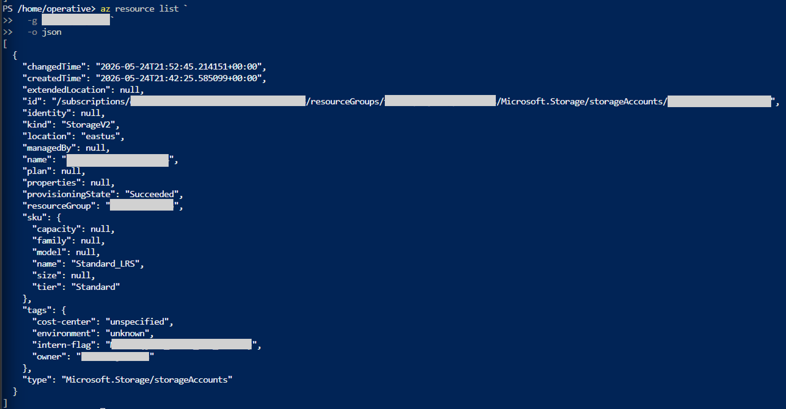
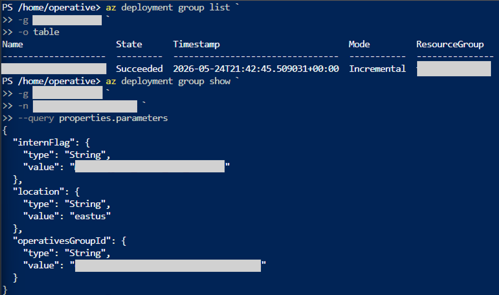
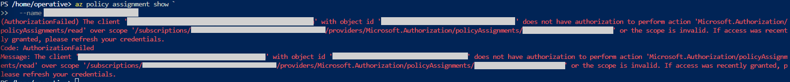

# Investigation Report
## Azure Governance Investigation - Operation Dead Deploy

## 1. Purpose

This report documents a read-only investigation into a non-compliant Azure deployment within a live multi-user Azure training tenant.

The original lab was designed around the Azure Portal. I extended the exercise by performing Stages 1 through 3 with Azure CLI and continued using Azure CLI during Stage 4 until RBAC prevented a direct read of the subscription-level policy assignment.

---

## 2. Five-W Summary

| Question | Finding |
|---|---|
| Who | Junior intern with temporary Contributor access |
| What | Non-compliant resource group containing one Azure Storage account |
| When | ARM deployment timestamp preserved in deployment evidence |
| Where | Mad Hat Labs training subscription; workload located in East US |
| Why | Naming policy used `Audit` instead of preventive `Deny` |

---

## 3. Scope

### Included

- subscription-level resource-group inventory
- current-state resource inventory and tags
- ARM deployment parameters
- ARM deployment history
- Azure Policy state
- custom Naming Convention policy definition
- Azure PowerShell validation
- subscription-level policy-assignment investigation
- RBAC limitation
- final assignment review in Azure Portal

### Excluded

Other Azure resources in the shared training subscription were outside this incident's scope.

---

## 4. Access Model

| Role | Access |
|---|---|
| Scenario intern | Temporary Contributor |
| Investigator | Reader |
| Investigation mode | Observe only |

No modifying commands were used.

---

## 5. Evidence Timeline

| Sequence | Investigation Activity | Evidence |
|---:|---|---|
| 1 | Resource-group naming anomaly identified | E-01 |
| 2 | Current resource and tags inspected | E-02 |
| 3 | Deployment parameters inspected | E-03 |
| 4 | Deployment history reviewed | E-04 |
| 5 | Policy state reviewed | E-05 |
| 6 | Policy definition traced with Azure CLI | E-06 |
| 7 | Policy definition validated with Azure PowerShell | E-07 |
| 8 | Direct assignment read blocked by RBAC | E-08 |
| 9 | Assignment reviewed in Azure Portal | E-09 |

---

## 6. Detailed Investigation

### 6.1 Resource-Group Discovery

```powershell
az group --help
az group list -o table
```

Most resource groups followed the expected `rg-` naming pattern. One did not.

> 

**Assessment:** the naming anomaly justified further inspection.

---

### 6.2 Current-State Resource and Tag Inspection

```powershell
az resource list `
  -g <RESOURCE_GROUP> `
  -o json
```

The current resource inventory showed one Azure Storage account with:

- `kind`: `StorageV2`
- `location`: `eastus`
- `provisioningState`: `Succeeded`
- `sku.name`: `Standard_LRS`
- `type`: `Microsoft.Storage/storageAccounts`

Tags included:

- `cost-center`
- `environment`
- `intern-flag`
- `owner`

> 

**Assessment:** Stage 2 evidence came directly from the live resource's current-state metadata.

---

### 6.3 Deployment Parameters

```powershell
az deployment group show `
  -g <RESOURCE_GROUP> `
  -n <DEPLOYMENT_NAME> `
  --query properties.parameters
```

The parameters included `internFlag`, `location`, and `operativesGroupId`.

> 

**Assessment:** this showed deployment-time input data rather than current resource state.

---

### 6.4 Deployment History

```powershell
az deployment group list `
  -g <RESOURCE_GROUP> `
  -o table
```

The deployment record showed a successful Incremental deployment and a timestamp.

> 

**Assessment:** ARM deployment history supplied the provisioning audit trail.

---

### 6.5 Policy State

```powershell
az policy state list `
  -g <RESOURCE_GROUP> `
  -o table `
  --query "[].{PolicyReference:policyDefinitionReferenceId, PolicyName:policyDefinitionName, Compliance:complianceState, ActionPerPolicy:policyDefinitionAction, Location:resourceLocation}"
```

The relevant record showed `NonCompliant` with an action of `audit`.

> 

**Assessment:** Azure Policy successfully detected the violation.

---

### 6.6 Policy Definition

```powershell
az policy definition show `
  --name <POLICY_DEFINITION_ID>
```

The definition showed:

- `Naming Convention`
- `All`
- `Custom`
- allowed effect values `Audit`, `Deny`, `Disabled`
- default value `Audit`
- target resource type `Microsoft.Resources/subscriptions/resourceGroups`
- resource-group names `notLike` `rg-*`

>  

**Assessment:** the policy definition was capable of identifying the naming violation.

---

### 6.7 Azure PowerShell Validation

```powershell
Get-AzPolicyDefinition -Name <POLICY_DEFINITION_ID>
```

The PowerShell result confirmed:

- DisplayName `Naming Convention`
- Mode `All`
- PolicyType `Custom`
- Version `1.0.0`

>  

**Assessment:** the Azure PowerShell result independently validated the custom definition.

---

### 6.8 Policy Assignment RBAC Failure

```powershell
az policy assignment show `
  --name <POLICY_ASSIGNMENT_NAME>
```

Azure returned:

```text
AuthorizationFailed
Microsoft.Authorization/policyAssignments/read
```

>  

**Assessment:** Reader access did not include direct subscription-level policy-assignment read permission.

---

### 6.9 Assignment Review in Azure Portal

The policy-assignment view showed:

- Name: `Naming Convention`
- Scope: `Mad Hat Labs`
- Definition type: `Policy`
- Policy enforcement: `Default`
- Effect: `Audit`

> 

**Assessment:** the assignment was configured to audit the violation rather than deny the request.

---

## 7. Root Cause Analysis

### Observed Control Path

```text
Resource-group name violates policy
        ↓
Azure Policy evaluates resource
        ↓
NonCompliant
        ↓
Effect = Audit
        ↓
Violation recorded
        ↓
Resource remains created
```

### Preventive Alternative

```text
Resource-group name violates policy
        ↓
Effect = Deny
        ↓
Request rejected
```

### Root Cause

The policy engine correctly detected the naming violation. The governance control was configured for **Audit**, which is detective, rather than **Deny**, which is preventive.

---

## 8. Investigation Challenge

The major troubleshooting issue was the RBAC boundary on the policy assignment.

The Portal presented compliance as a connected workflow, while the CLI investigation required correlation of:

```text
Policy State
Policy Definition
Policy Assignment
```

The Reader identity could inspect the first two but could not directly read the assignment object.

---

## 9. Findings

### Finding 1 - Naming Standard Violation
A resource group violated the expected naming pattern.

### Finding 2 - Single Workload Resource
The resource group contained one Azure Storage account.

### Finding 3 - Deployment Audit Trail Available
ARM deployment history exposed a successful Incremental deployment and timestamp.

### Finding 4 - Policy Evaluation Worked
Azure Policy marked the resource group `NonCompliant`.

### Finding 5 - Audit Did Not Prevent Creation
The effective policy behavior was `Audit`.

### Finding 6 - Reader RBAC Boundary
The operative identity could query compliance state and definition data but not directly read the subscription-level assignment.

---

## 10. Recommendations

1. Test the naming policy in Audit mode and transition to Deny where preventive enforcement is required.
2. Review temporary Contributor access scope and duration.
3. Use time-bound elevation when supported.
4. Enforce meaningful tag values at deployment time.
5. Document intentional Audit-mode exceptions.
6. Monitor policy compliance for governance drift.

---

## 11. What I Learned

- Current resource state and deployment history answer different investigative questions.
- Azure Policy definitions, assignments, and states are separate objects.
- `Audit` detects while `Deny` prevents.
- JMESPath improves CLI-based investigation efficiency.
- RBAC can expose compliance evidence while restricting direct access to a governance object.

---

## 12. Disclosure

This investigation was performed in a live multi-user Azure training tenant. Challenge answers, flags, usernames, GUIDs, tenant IDs, subscription IDs, and other environment-specific identifiers are intentionally redacted.
